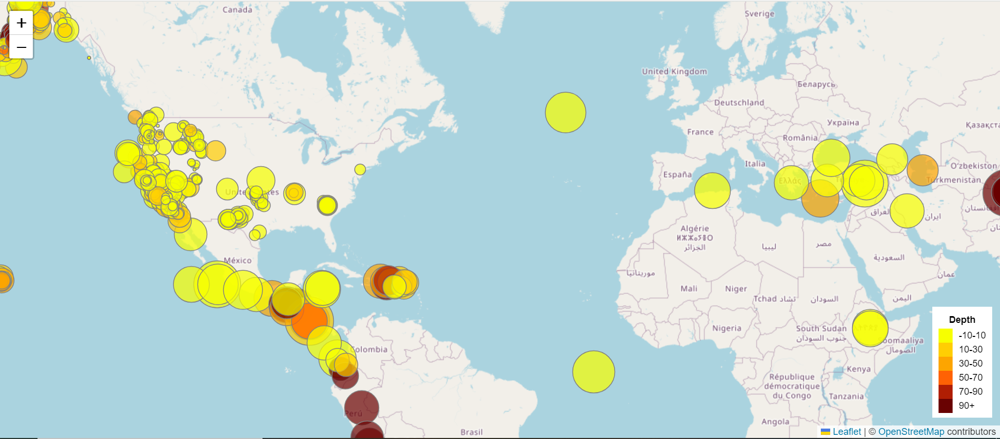
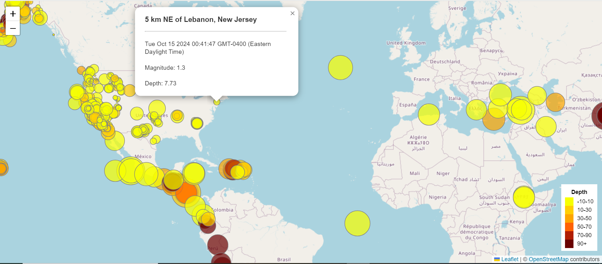
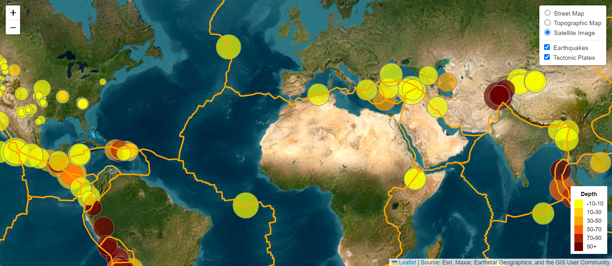

# leaflet-challenge
# LeafletChallenge

A semi-static map and interactive map built visualizing the occurence of earthquakes and their attributes as per data from the United States Geological Survey (USGS)

## Description

The United States Geological Survey (USGS), is responsible for providing scientific data about natural hazards, the health of our ecosystems and environment, and the impacts of climate and land-use change. Their scientists develop new methods and tools to supply timely, relevant, and useful information about the Earth and its processes.

The USGS is interested in building a new set of tools that will allow them to visualize their earthquake data. They collect a massive amount of data from all over the world each day and are exploring meaningful ways of displaying it. In this hypothetical scenario, I have been tasked with developing a way to visualize USGS data that will allow them to better educate the public and other government organizations (and hopefully secure more funding) on issues facing our planet.

The result is comprised of two maps that provide the option of a semi-static or interactive view of the data:

### Leaflet Part 1
This version maps out all earthquakes across the globe that were recorded by USGS within the past 7 days.  Recorded earthquakes are displayed as circular markers where the size of the marker reflects the earthquakes magnitude (the larger the magnitude, the larger the circle) and the color represents the recorded depth of the earthquake (as per the displayed legend).

Clicking on any of the markers will display a popup that shows the approximate location of the recorded earthquake, the recorded time of its occurence, the magnitude, and its depth.

### Leaflet Part 2
This version creates a similar map but includes a control panel that makes it possible to adjust what is displayed.  A user can select from display a street map, a topographical map, or a satellite image as the main base map.  The earthquake data from the previous map is also available with all of its features but the markers for this overlay can be toggled on or off using the control panel.  There is also an additional overlay option of displaying the boundaries for the planet's tectonic plates, which provides some visual rationale as to why some regions may experience more earthquakes than others.

Note: Since the markers are determined by a live feed of data that USGC periodically updates, the resulting markers may not match up to what is displayed in the above screenshots.

### Dependencies
* Any web browser program that will open 'index.html' (Google Chrome is recommended)
* An active internet connection so that 'index.html' can access the GeoJSON datasets via API calls and the necessary libraries.

### Installing & Execution
The repository files can be downloaded to open either version of the 'index.html' files.  Note that since both 'index.html' files contain relative file paths, it is important that the file locations within either directory are not changed in order to execute properly.

## Authors

Daniel Pineda

## Acknowledgments
LeafletChallenge was created as an assignment for the University of California, Irvine Data Analytics Bootcamp - June 2024 Cohort under the instruction and guidance of Melissa Engle (Instructor) and Mitchell Stone (TA).
The practical exercises and coding examples demonstrated through the bootcamp helped inform and inspire the code for this project.

Additionally, the following resources were used for further reference:

* [javascript - How to add legend in Leaflet Map? - Stack Overflow](https://stackoverflow.com/questions/59453642/how-to-add-legend-in-leaflet-map) - referenced for how to create and format a legend in a Leaflet map (Leaflet-Part-1:'logic.js' - lines 57-79, Leaflet-Part-1:'logic.js' - lines 98-120)
* [Documentation - Leaflet - a JavaScript library for interactive maps](https://leafletjs.com/reference.html) - referenced for syntax and structure for adjusting marker styling and formatting (Leaflet-Part-1:'logic.js' - lines 36-51, Leaflet-Part-1:'logic.js' - lines 24-39)